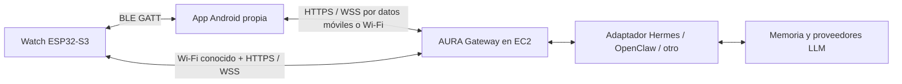

# AURA Watch: app Android y conexión con EC2

Fecha: 2026-09-04. Diseño propuesto; app y protocolo pendientes de implementar.
La placa Waveshare está comprada y pendiente de recepción. El estado del servidor
se toma de `research/08-estado-actual.md`; no se ha comprobado su ejecución en vivo
durante esta investigación.

## Experiencia objetivo

Instalar la app propia de AURA en Android, pulsar «Añadir reloj», seleccionar AURA
Watch y confirmar la vinculación. Después, el reloj se reconecta al acercarse al
teléfono, recibe avisos y permite conversar sin abrir la app en cada interacción.
El teléfono proporciona Internet mediante sus datos móviles o Wi-Fi.

La app Android es el puente y centro de configuración. El firmware del reloj corre
en ESP32-S3; no requiere Wear OS. Vincularlo solo desde los ajustes de Bluetooth
no instala el protocolo de AURA ni crea el puente a Internet.

## Rutas de comunicación

BLE será la ruta cotidiana. La app recibe eventos del reloj y los reenvía al gateway;
el proceso inverso lleva respuestas y avisos a la muñeca. Esto es un relay a nivel
de aplicación, no tethering IP por Bluetooth.

Wi-Fi directo permite operar sin el teléfono cuando hay una red configurada con
Internet. Se podrá preferir durante conversaciones largas o actualizaciones, tras
medir su consumo. No será necesario activar un hotspot para usar la ruta BLE.

| Situación | Comportamiento propuesto |
|-----------|-------------------------|
| Teléfono cercano con Internet | BLE → app → EC2; Wi-Fi del reloj apagado si no hace falta |
| Teléfono ausente, Wi-Fi conocido | Reloj → EC2 directamente |
| BLE disponible, teléfono sin Internet | Funciones locales y cola de mensajes con vencimiento |
| Ningún enlace disponible | Hora, alarmas descargadas y estado sin conexión |
| EC2 no disponible | Mostrar servicio desconectado, reintentar y conservar mensajes válidos |

El gateway registra una ruta activa por reloj con caducidad. `device_id`,
`session_id` y `message_id` se conservan al cambiar de transporte; los ACK y la
deduplicación evitan repetir avisos o acciones. Los eventos vencidos se descartan.
Si una conversación pierde la red, primero se muestra la interrupción y se intenta
reanudar con cursor; no se promete continuidad de audio sin cortes.

## App Android recomendada

Propuesta: **Kotlin + Jetpack Compose**, para trabajar directamente con las APIs de
dispositivos asociados, Bluetooth y ciclo de vida de Android. Compose es el toolkit
nativo recomendado por Android. Flutter puede evaluarse si después se priorizan
varias plataformas; el servicio BLE seguiría necesitando integración nativa.
[Fuente: Compose](https://developer.android.com/compose).

Pantallas iniciales:

- **Inicio:** reloj conectado, batería, ruta activa y estado de EC2 por separado.
- **Conversación:** hablar/escribir a AURA, respuestas y acciones pendientes.
- **Mi reloj:** Wi-Fi, volumen, brillo, wake word y actualizaciones.
- **Avisos:** preferencias de voz, vibración, privacidad y no molestar.
- **Conexión:** diagnóstico sencillo, reconectar y desvincular.

Propuesta interna: módulo BLE, cliente HTTPS/WSS, cola local persistente, estado de
sesiones y configuración. Evaluar Android BLE Library de Nordic para serializar
operaciones GATT, gestionar MTU y fragmentación. La biblioteca no sustituye las
reglas de segundo plano de Android.
[Fuente: Nordic](https://github.com/nordicsemi/Android-BLE-Library).

## Vinculación y segundo plano

Usar `CompanionDeviceManager` para asociar el accesorio mediante el diálogo del
sistema. Esta asociación no crea por sí misma la conexión GATT ni el vínculo
criptográfico Bluetooth: el cliente debe establecerlos. AURA confirmará posesión
con una interacción en la pantalla del reloj y conservará una identidad de
dispositivo, separada de su nombre anunciado.
[Fuente: asociación](https://developer.android.com/develop/connectivity/bluetooth/companion-device-pairing).

Para escuchar eventos del reloj durante periodos largos, priorizar
`CompanionDeviceService` y observación de presencia. Un servicio foreground de tipo
`connectedDevice`, con notificación visible, es alternativa para transferencias
persistentes. El cliente GATT reconecta y vuelve a suscribir características al
recuperar el enlace. Evitar escaneos periódicos constantes.

Si Android termina el proceso, la conexión se cierra: hay que recuperar estado y
reabrirla. La asociación no garantiza ejecución eterna. Probar pantalla bloqueada,
Doze, ahorro de batería, reinicio y cierre forzado; este último requiere que el
usuario vuelva a abrir la app. Comprobar además cómo se comporta la dirección BLE
de la placa con las limitaciones de descubrimiento del Companion Device Manager.
[Fuente: BLE en segundo plano](https://developer.android.com/develop/connectivity/bluetooth/ble/background).

Permisos según versión y función: `BLUETOOTH_CONNECT`, y `BLUETOOTH_SCAN` cuando la
app escanee; notificaciones donde corresponda. No solicitar ubicación para el
enlace si no se usa para deducirla; calendario o ubicación se pedirían al activar
funciones concretas. El relay de bytes de audio del reloj no usa el micrófono del
teléfono. Grabar con el teléfono sí requiere permiso y cumplir las restricciones
del servicio de micrófono en segundo plano.
[Bluetooth](https://developer.android.com/develop/connectivity/bluetooth/bt-permissions),
[servicios foreground](https://developer.android.com/develop/background-work/services/fgs/service-types).

## Protocolo BLE propio

El S3 es periférico/servidor GATT; Android es central/cliente. UUID y esquema
binario se fijarán antes de desarrollar ambos extremos. Propuesta de servicios:

| Característica | Uso |
|----------------|-----|
| Capabilities / versión | Negociar versión, codecs, tamaños y funciones |
| Control | Inicio/cancelación de turno, configuración y ACK |
| Events | Estado, wake_detected, botones y avisos |
| Audio uplink | Fragmentos reloj → teléfono mediante notifications |
| Audio downlink | Fragmentos teléfono → reloj mediante writes |
| Battery / device info | Estado del dispositivo |

Negociar MTU real, serializar operaciones, limitar colas y usar números de
secuencia, créditos y ACK de aplicación. Un write o notification BLE no demuestra
que EC2 ejecutó una acción. El provisioning Wi-Fi usa un flujo separado, basado
en las herramientas de Espressif y una sesión autenticada; conservar BLE operativo
después de configurar la red.
[Fuente: provisioning S3](https://docs.espressif.com/projects/esp-idf/en/stable/esp32s3/api-reference/provisioning/provisioning.html).

## Voz desde el reloj fuera de casa

La propuesta anterior de reservar todo el audio para Wi-Fi era incompleta: la ruta
BLE debe poder transportar voz del reloj cuando solo el teléfono tiene Internet.
No asumimos un perfil estándar de auriculares ni LE Audio. Usaremos datos de audio
en nuestro servicio GATT sobre BLE; soporte de BLE no garantiza perfiles de audio.
[Referencia del stack S3](https://docs.espressif.com/projects/esp-idf/en/stable/esp32s3/api-reference/bluetooth/bt_le.html).

Primera prueba: voz por turnos, pulsando un botón; después wake word local. El S3
captura, comprime y envía segmentos; Android los transmite a EC2 para STT y
razonamiento. La respuesta TTS vuelve comprimida y el reloj la reproduce.

PCM mono a 16 kHz y 16 bits necesita 256 kbit/s antes de overhead. Evaluar ADPCM
como implementación simple u Opus si el perfil elegido cabe en CPU/memoria. Como
objetivo experimental para Opus, 16–24 kbit/s; no es un rendimiento medido. Medir
también decodificación, buffers, pérdida de paquetes y coexistencia con pantalla.

La charla continua, las interrupciones y el eco requieren pruebas posteriores.
Wi-Fi directo ofrece una segunda ruta para audio. Si BLE no alcanza la calidad
necesaria, mantener voz por turnos o usar temporalmente el audio del teléfono como
opción explícita, conservando la voz en el reloj como objetivo.

## Integración con la EC2 existente

La documentación registra Hermes, Bedrock, Telegram y Discord en EC2. Esto no prueba
que ya exista una API de dispositivos: falta verificar la versión instalada y su
interfaz de integración. Diseñar un servicio AURA Gateway junto a Hermes, accesible
por un dominio HTTPS/WSS con autenticación. Usar un adaptador para llamadas y eventos
de Hermes; no asumir que el puerto o endpoint de salud documentado acepta chat.

Contrato inicial propuesto (todavía no implementado):

- enrolar/revocar dispositivos y emitir tokens limitados;
- abrir sesiones y negociar transporte/codecs;
- WebSocket bidireccional para eventos y audio;
- recuperar mensajes desde el último cursor confirmado;
- mostrar salud de gateway, orquestador y proveedor por separado.

La app inicia conexión saliente a EC2 desde cualquier red. Las credenciales de
Bedrock permanecen en el servidor mediante IAM; el teléfono guarda sus tokens
protegidos con Android Keystore. El reloj posee credenciales revocables propias
para Wi-Fi directo. Las identidades de Telegram/Discord se vinculan explícitamente
a la cuenta para compartir contexto sin mezclar conversaciones de terceros.

Para avisos con la app dormida, evaluar FCM como aviso de evento pendiente; la app
recupera el contenido de EC2 y lo pasa por BLE. Prioridad alta solo para avisos
urgentes visibles al usuario; no como keepalive. FCM y un socket persistente no
garantizan entrega instantánea. Descargar recordatorios próximos al reloj permite
avisar aunque la red falle.
[Fuente: prioridad FCM](https://firebase.google.com/docs/cloud-messaging/android-message-priority).

Los bots de AURA pueden generar avisos directamente desde EC2. Replicar además
notificaciones de otras apps del teléfono es una función opcional distinta, que
necesitaría acceso concedido por el usuario y filtros por app.

## Orden de implementación y validación

1. App Android con reloj simulado y chat de texto contra un gateway de desarrollo.
2. Placa recibida: asociación, batería, botón y tarjeta de respuesta por BLE.
3. Recorrido completo: botón → BLE → app → EC2/Hermes → respuesta en reloj.
4. Reconexión, pantalla bloqueada y avisos entrantes sin abrir la app.
5. Audio por turnos por BLE; medir consumo y latencia con datos móviles.
6. Wi-Fi directo y cambio de ruta sin duplicar mensajes/acciones.
7. Wake word, voz proactiva, mejoras de audio y OTA.

Antes de dar el enlace por estable: medir una jornada con pantalla apagada,
alejamiento/regreso, Bluetooth desactivado, reinicio, caída de EC2, expiración de
token y recepción repetida del mismo mensaje. Registrar teléfono y versión Android,
consumo, tiempo de reconexión, errores y latencia de voz. Objetivos numéricos se
fijarán tras medir la primera placa; ninguna prueba de hardware se ha ejecutado aún.
