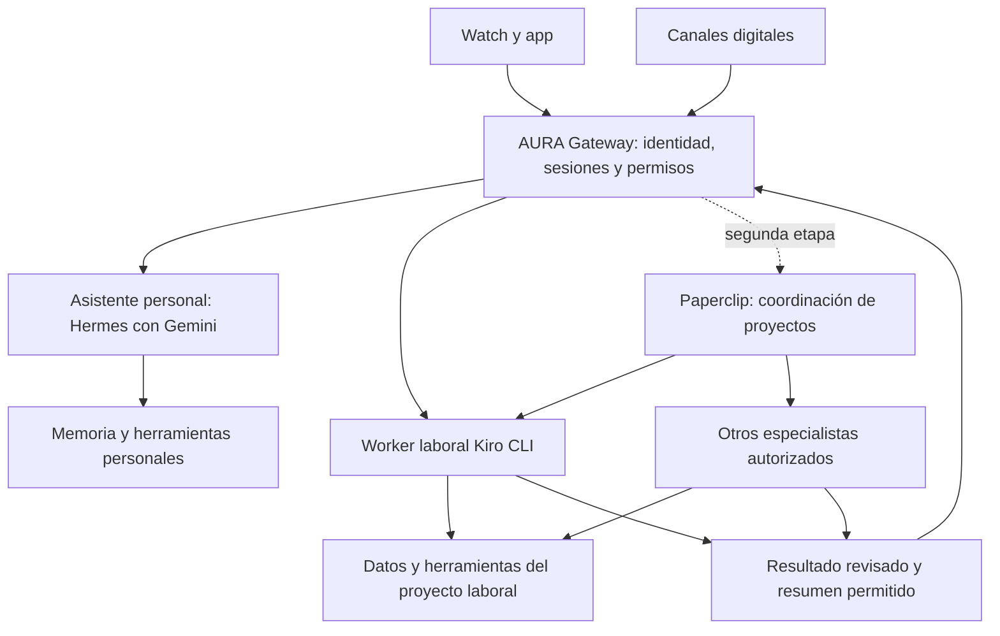

# AURA: gateway, especialistas y coordinación de trabajo

Fecha de revisión: 2026-10-03. Estado: propuesta para validar, sin despliegue.

El usuario confirmó esta arquitectura inicial y la integración del motor mediante
API. Se documenta como diseño acordado; no se han implementado adaptadores todavía.

Requisitos confirmados por el usuario: agentes locales en Kiro IDE; EC2 como
nodo principal cuando el PC esté apagado; aproximadamente US$30 de créditos AWS
mensuales; servicios contenerizados y memoria respaldada en Git para migrar a
otro servidor o al equipo local.

Recuperación confirmada: EC2 es el único nodo activo normal. El notebook de
respaldo permanece apagado y se enciende manualmente si EC2 cae. No hay standby
24/7, sincronización continua entre hosts ni conmutación automática.

Actualización del mismo día: la suscripción Kiro del trabajo debe financiar solo
el dominio laboral; Gemini será el proveedor previsto para el dominio personal.

## Suscripción Kiro y consumo separado

Kiro documenta explícitamente que las llamadas del CLI autenticadas mediante
API key descuentan créditos de la suscripción. La clave se genera en la sección
API Keys de app.kiro.dev para cuentas elegibles y se inyecta al worker como
`KIRO_API_KEY`. No es una clave genérica de Anthropic/OpenAI ni transfiere un saldo
de tokens a otro proveedor: se invoca Kiro y Kiro contabiliza el trabajo.

El CLI da prioridad a una sesión de navegador activa sobre la API key; comprobar
la identidad con `kiro-cli whoami` evita usar otra cuenta sin advertirlo. En cuentas
corporativas, la generación de API keys puede estar gobernada por el administrador.

Fuentes: [autenticación y cargo a la suscripción](https://kiro.dev/docs/cli/authentication/),
[gobierno de API keys](https://kiro.dev/docs/enterprise/governance/api-keys/).

Hay tres rutas concretas:

| Ruta | Integración | Estado documentado |
| --- | --- | --- |
| AURA → worker Kiro headless | CLI con API key y agente seleccionado | Ruta oficial para automatización, prioritaria para probar facturación |
| OpenClaw → Kiro ACP | Plugin ACPx; `kiro` figura entre los ejecutores soportados | Integración documentada; comprobar CLI y autenticación compatibles |
| Hermes → Kiro ACP | Plugin comunitario `kiro-acp` como proveedor externo | Catálogo oficial; autor declara validación con CLI 2.22.0, no con V3 |

Fuentes: [headless](https://kiro.dev/docs/cli/headless/),
[Kiro en OpenClaw ACPx](https://docs.openclaw.ai/tools/acp-agents-setup),
[plugin comunitario Hermes](https://hermes-agent.nousresearch.com/docs/plugins/kiro-acp).

El plugin Hermes usa el login del subprocess Kiro según su documentación.
No trasladar automáticamente a ACP las instrucciones de API key de headless:
son rutas distintas que deben probarse. V3 cambia selección de agentes y
autenticación ACP, de modo que los argumentos V2 del plugin pueden necesitar ajuste.

Ejemplo de smoke test orientativo, con credencial ya inyectada y desde el proyecto
laboral autorizado; no se ejecutó ni consumió créditos en esta revisión:

```text
kiro-cli whoami
kiro-cli chat --agent-engine v3 --agent especialista --no-interactive --trust-tools=read,grep --output-format stream-json "Resume la documentación de este proyecto"
```

Registrar saldo/uso antes y después desde Kiro. Créditos no equivalen a un número
fijo de tokens: Kiro documenta consumo fraccionario por petición, y diferencias
por modelo y esfuerzo. Las iteraciones y especialistas adicionales también
realizan trabajo y pueden aumentar consumo.
Fuentes: [billing Kiro](https://kiro.dev/docs/billing/),
[modelos y esfuerzo](https://kiro.dev/docs/models/).

Propuesta de enrutamiento: el gateway usa dominio explícito sin una llamada LLM
para decidir cada vez. Personal → motor Gemini; trabajo → Kiro directamente,
con respuesta laboral elaborada por Kiro. Si Gemini planifica o resume una tarea
que también ejecuta Kiro, ambos servicios consumen; evitarlo por defecto. Si el
dominio laboral falla o agota cuota, mantener la tarea pendiente y avisar sin
trasladarla automáticamente al proveedor personal.

Gemini API usa su propio proyecto, cuotas y facturación. Los beneficios de una
suscripción Google AI dentro de AI Studio no cubren automáticamente llamadas
de una aplicación externa como AURA. Puede usarse la cuota gratuita de los modelos
elegibles o configurar consumo pagado separado.
Fuentes: [planes Google AI y API](https://ai.google.dev/gemini-api/docs/google-ai-plans),
[billing Gemini](https://ai.google.dev/gemini-api/docs/billing/).

Mantener tres métricas independientes: créditos laborales Kiro, consumo personal
Gemini y gasto de infraestructura AWS. El saldo mensual de AWS no es el saldo
de Kiro. Paperclip puede coordinar estos ejecutores, pero no cambia quién factura.

## Recomendación

Recomendación inicial: AURA Gateway pequeño para la app y el reloj; Hermes como
motor personal configurado con Gemini; worker Kiro CLI separado para trabajo,
autenticado contra la suscripción laboral. Hermes figura en los antecedentes de
EC2, aunque su instalación no se ha comprobado; esta elección es provisional
hasta validar proveedor, API y funcionamiento real.

El gateway enruta el dominio laboral directamente al worker Kiro, sin gastar
Gemini para clasificar, planificar o resumir esas tareas. Memorias, credenciales,
sesiones y almacenamiento permanecen separados. Los canales existentes pueden
usar las integraciones del motor; no es necesario reimplementarlos en el gateway.

Paperclip se deja para una segunda etapa, cuando varias tareas/especialistas
necesiten asignación y seguimiento. OpenClaw es la alternativa si las pruebas
demuestran que su integración ACP o sus canales resuelven mejor el caso real.
Kiro Crew queda como alternativa estudiada. No instalar los tres motores a la vez.

## Qué existe en AURA

El README y docs/12-arquitectura-nodos-aura.md ya separan gateway y orquestador.
research/03-stack-recomendado.md registra Hermes en EC2, pero esta revisión no
comprobó el servidor, su versión ni su estado operativo. La integración IA del
reloj y la aplicación Android siguen descritas como pendientes.

Los documentos antiguos incluyen estimaciones de costos y ejemplos de failover;
no constituyen precios actuales ni una implementación validada.

## AURA Gateway y adaptadores API acordados

El gateway será una capa pequeña para app/reloj: autentica dispositivos, conserva
sesión y dominio autorizado, dirige solicitudes y devuelve eventos. El motor
existente ejecuta razonamiento, herramientas y delegación. Los canales que ya
ofrece el motor pueden usar sus integraciones sin duplicarlas en el gateway.

Interfaz interna propuesta para cada adaptador: iniciar solicitud, transmitir
eventos, consultar ejecución, cancelar y comprobar disponibilidad. AURA conserva
identificadores propios y los relaciona con los de cada motor. Normalizar mensajes,
progreso, resultado, aprobación y error sin suponer equivalencia completa entre APIs.

- Hermes primero: API HTTP para mensajes/ejecuciones y streaming SSE. Comprobar
  capacidades de la versión instalada y usar endpoints con continuidad de sesión
  cuando se requiera; no confundir una llamada stateless con memoria conversacional.
- OpenClaw después: protocolo WebSocket con autenticación, roles y scopes;
  traducir sus métodos/eventos a la interfaz AURA y verificar reconexión/cancelación.
- Kiro laboral: worker CLI headless inicialmente; ACP tras validación. No requiere
  pasar por el modelo Gemini personal para ejecutar ni preparar la respuesta laboral.

Fuentes: [API Hermes](https://hermes-agent.nousresearch.com/docs/user-guide/features/api-server/),
[protocolo OpenClaw](https://docs.openclaw.ai/gateway/protocol).

App/reloj usarán HTTPS o WSS hacia AURA Gateway. Los motores permanecen en la red
interna de contenedores con credenciales de servicio en el servidor. Credenciales
de dispositivo limitadas y revocables; no enviar claves de proveedores al Watch.
Cada conversación tiene un motor responsable. Cambiarlo necesita traducir o
reiniciar el contexto según compatibilidad, no solo cambiar una URL.

MVP: texto, identificación de dispositivo, sesiones por dominio, enrutamiento,
eventos de tarea y deduplicación. Audio continuo, failover automático y panel de
coordinación de proyectos quedan fuera de esta primera implementación. El
failover entre hosts está reemplazado por recuperación manual en notebook.

## Separar cuatro responsabilidades

| Responsabilidad | Función en AURA |
| --- | --- |
| Gateway de dispositivos | Autenticación del reloj/app, sesiones, eventos, voz y avisos |
| Motor de agentes | Conversar, usar herramientas y delegar una tarea |
| Coordinación de proyectos | Asignación, cola duradera, seguimiento, presupuesto y revisión |
| Acceso a modelos | Credenciales del proveedor, selección de modelo y límites de consumo |

Hermes y OpenClaw tienen sus propios gateways, pero eso no los convierte
automáticamente en el contrato de hardware de AURA. Paperclip pertenece sobre
todo a la coordinación de proyectos. Kiro CLI es un ejecutor de agentes, mientras
Kiro Crew agrega una superficie persistente de asistencia.

## Comparación con documentación oficial

| Opción | Capacidades verificadas | Encaje propuesto | Pendiente de probar |
| --- | --- | --- | --- |
| Hermes Agent | Memoria, skills, MCP, canales, perfiles y delegación | Motor inicial si la instalación existente resulta aprovechable | API/streaming, latencia, perfiles aislados y proveedor elegido |
| OpenClaw | Enrutamiento multiagente, estados por agente y puente ACP | Alternativa para muchas cuentas/canales y agentes con rutas explícitas | Integración Kiro concreta y sandbox por dominio |
| Paperclip | Tareas, presupuestos, aprobaciones y adaptadores de ejecutores | Coordinación de trabajo prolongado | Adaptador Kiro, medición de costos y recuperación |
| Kiro CLI | Agentes personalizados, ACP y ejecución headless | Reutilizar especialistas existentes | Tipo y versión de los agentes del usuario, autenticación y dependencias |
| Kiro Crew | Gateway persistente, memoria, canales, programación y subagentes | Comparador obligatorio por el uso actual de Kiro | Reutilización exacta de perfiles existentes, API para AURA y separación de datos |

Fuentes: [Hermes](https://hermes-agent.nousresearch.com/docs/),
[OpenClaw multiagente](https://docs.openclaw.ai/concepts/multi-agent),
[Paperclip](https://paperclip.ing/), [Kiro CLI](https://kiro.dev/docs/cli/),
[Kiro Crew](https://kiro.dev/docs/crew/).

## Paperclip: utilidad y alcance

Resulta útil cuando AURA recibe una petición como «prepara el informe, solicita
una revisión y avísame cuando esté listo». La petición se convierte en tarea,
con propietario, estado y resultado. El reloj recibe un aviso al finalizar;
no necesita esperar a que todos los especialistas terminen.

La documentación actual enumera `hermes_local`, `hermes_gateway`,
`openclaw_gateway`, `process` y `http`, además de otros ejecutores.
No enumera un adaptador nativo de Kiro. La integración propuesta necesita un
wrapper de proceso, un servicio HTTP o un adaptador propio.

La página comercial anuncia presupuestos con pausa automática. La documentación
del runtime aclara que uso/costo depende de lo que aporte cada adaptador. Con Kiro
debemos verificar ese reporte y sumar límites propios de tiempo, concurrencia y
número de llamadas; no asumir que Paperclip controla toda la facturación externa.

Fuentes: [adaptadores y ejecución](https://github.com/paperclipai/paperclip/blob/master/docs/agents-runtime.md),
[adaptador Hermes](https://github.com/paperclipai/paperclip/blob/master/packages/adapters/hermes/README.md).

## Conectar los agentes de Kiro

### Primera prueba: una tarea de lectura

Si los agentes son perfiles accesibles en Kiro CLI, el worker puede ejecutar
`kiro-cli chat --agent <nombre>` en el proyecto autorizado. Para automatización,
la documentación ofrece `--no-interactive`, `--output-format stream-json` en
V2/V3 y confianza limitada a categorías de herramientas. Headless documenta
autenticación con `KIRO_API_KEY`: no asumir que la sesión del IDE basta.

Ejemplo orientativo, pendiente de comprobar contra la versión instalada:

```text
kiro-cli chat --agent-engine v3 --agent especialista --no-interactive --trust-tools=read,grep --output-format stream-json "Analiza la documentación del proyecto y entrega hallazgos con evidencia"
```

Invocar el proceso con argumentos separados, sin construir comandos de shell
con texto del usuario. Capturar salida, error, código de cierre y evento final;
poner un límite de tiempo y tratar cancelación/interrupción como final de ejecución.

Fuente: [headless oficial](https://kiro.dev/docs/cli/headless/).

### Integración duradera: ACP

ACP permite administrar sesiones, transmitir avances y cancelar una tarea.
Un adaptador de AURA puede actuar como cliente ACP de Kiro. MCP tiene otra
responsabilidad: ofrecer herramientas y datos a los agentes. Puede exponerse
una herramienta MCP que invoque un especialista, pero necesita el adaptador
de ejecución y los controles de dominio detrás.

Hay una diferencia relevante entre generaciones de Kiro:

- V2 documenta `kiro-cli acp --agent <nombre>`.
- V3 documenta `kiro-cli acp --agent-engine=v3 --auth-method=cli` y selecciona
  agente/modelo tras inicializar la sesión. Rechaza `--agent` al arrancar ACP.
- Negociar capacidades y mantener adaptadores V2/V3 separados mientras se soporten
  ambos; el número de versión del protocolo ACP no distingue las generaciones.

Fuentes: [ACP](https://kiro.dev/docs/cli/acp/),
[migración ACP V3](https://kiro.dev/docs/cli/v3/acp-migration/).

## Arquitectura propuesta



Este diagrama es una propuesta de integración, no una capacidad ya demostrada.
Una consulta breve puede ir directamente al worker laboral; Paperclip se usa
para trabajo que necesita seguimiento y coordinación. Debe existir un solo
responsable de programar y reintentar cada tarea para evitar ejecuciones dobles.

## Personal y trabajo: separación ejecutable

La misma voz y pantalla pueden presentar ambos dominios. Cada petición lleva un
dominio autorizado, y todo el recorrido conserva esa identificación.

- Memorias, sesiones, credenciales y almacenes de búsqueda separados.
- Identidad de servicio y herramientas específicas por dominio/proyecto.
- Workers bajo usuarios de sistema, contenedores o máquinas separados según
  sensibilidad; restringir filesystem, red y credenciales desde el sistema.
- Datos laborales permanecen en el entorno laboral permitido. El servidor
  personal recibe solo los resultados o resúmenes cuya transferencia se autoriza.
- Selección de dominio por la sesión/canal y confirmación cuando sea ambigua;
  el clasificador LLM no decide por sí solo permisos de acceso.
- `aura-memory` puede conservar preferencias personales; separar los registros
  laborales y aplicar retención propia. No mezclar conversaciones privadas con
  documentación de trabajo mediante una sincronización global.

Un prompt que diga «no leas datos personales» no establece aislamiento.
OpenClaw advierte que el workspace es un cwd, no un sandbox. Hermes distingue
perfiles y subagentes: una conversación nueva no equivale a un perfil separado;
`SOUL.md` tampoco impone límites del filesystem.

Fuentes: [aislamiento OpenClaw](https://docs.openclaw.ai/concepts/multi-agent),
[perfiles Hermes](https://hermes-agent.nousresearch.com/docs/user-guide/profiles/),
[permisos Kiro](https://kiro.dev/docs/cli/chat/security/).

## Agentes permanentes y subagentes temporales

Un especialista permanente necesita rol, versión de instrucciones, capacidades,
proyecto, memoria, runtime, herramientas, límites y responsable humano.
Un subagente temporal recibe una tarea acotada y termina al entregarla.

Propuesta inicial: AURA personal, un especialista Kiro existente y un revisor
para las tareas que lo necesiten. La especialidad exacta se define con el usuario.
Agregar agentes cuando una necesidad repetida lo justifique; tener muchas
personas ficticias no garantiza mejor calidad.

El coordinador puede proponer y crear configuraciones de nuevos especialistas
desde plantillas dentro de una política autorizada. La creación no concede
automáticamente credenciales, acceso a datos ni nuevos permisos. Paperclip
documenta aprobación para incorporar nuevos agentes.

## Contrato de tarea de AURA (propuesto)

Campos mínimos: `task_id`, `domain_id`, `project_id`, `agent_id`, `request_id`,
`input_refs`, `allowed_capabilities`, `deadline`, `budget`, `approval_state`.
El servidor calcula permisos efectivos; no confía en permisos enviados por el
reloj o escritos por el modelo.

Estados: queued, running, waiting_approval, succeeded, failed, cancelled.
Eventos: progreso, resultado, error y solicitud de aprobación. La conversación
recibe un acuse temprano y el resultado al terminar. El resumen para el Watch
puede ser breve sin perder el enlace al informe completo en el dominio adecuado.

Una cola duradera conserva tareas cuando el worker está desconectado. Usar claves
de idempotencia para efectos externos, bloqueo/lease de propietario y reconciliar
el resultado tras una caída. No reintentar a ciegas una operación cuyo efecto sea
incierto. Para cambios de código, aislar tareas concurrentes en worktrees.

## Prueba de decisión

1. Inventariar tipo/versión de Kiro, agentes, herramientas, MCP y ubicación.
2. Ejecutar una tarea de lectura con un agente existente y recuperar evidencia.
3. Validar Hermes con Gemini y su API; comparar con OpenClaw si aparecen limitaciones.
4. Registrar latencia inicial/final, calidad, intervenciones humanas, consumo
   disponible y complejidad de configuración. Sin ganadores por marketing.
5. Verificar bloqueo de acceso entre dominios a nivel de sistema, cancelación,
   worker desconectado y reinicio durante una tarea.
6. Si hacen falta colas, asignaciones y seguimiento, probar Paperclip con dos
   especialistas; verificar reanudación y límites con el adaptador Kiro.
7. Conectar el Watch después de validar el contrato por texto.

No se ejecutaron estas pruebas ni se instalaron herramientas en esta revisión.
Los agentes actuales son locales del IDE; quedan pendientes su formato, versión,
especialidades, dependencias y autorización para ejecutar datos laborales en EC2.
La documentación de Kiro comparte una referencia de configuración para IDE 1.0
y CLI 3.0, lo que ofrece una base de portabilidad. Eso no garantiza que recursos,
Powers, rutas locales o credenciales del IDE funcionen sin ajustes en el servidor.
Fuente: [configuración IDE/CLI](https://kiro.dev/docs/custom-agents/configuration-reference/).

## Despliegue portable en EC2

Propuesta: Docker Compose con un proyecto personal y otro laboral. Cada uno usa
su propia red interna, volúmenes, secretos y workers. El gateway frontal autentica
las peticiones y enruta con permisos; no monta todos los volúmenes ni expone todas
las credenciales a un motor común. Para datos más sensibles, separar también host
o VM: dos contenedores sobre un host compartido no equivalen a dos máquinas.

Servicios iniciales: gateway, un motor, almacenamiento persistente y worker Kiro.
Paperclip se incorpora si la prueba demuestra valor. No es necesario añadir un
broker, base vectorial y cluster de orquestación desde el primer día. Una cola
persistente en la base de datos puede bastar para el prototipo.

Portabilidad requiere imágenes con versiones fijadas, rutas relativas de Compose,
volúmenes explícitos, migraciones de base de datos, configuración de ejemplo,
secretos externos y procedimiento probado de restauración. No copiar un volumen
de base de datos activo sin un método consistente de backup.

El worker puede vivir en EC2 para agentes y datos autorizados allí. Si una tarea
depende de herramientas o datos que solo están en el equipo laboral, se ejecuta
en ese equipo: al apagarlo, AURA sigue conversando en EC2 y deja la tarea en cola.
No prometer ejecución remota de recursos que permanecen locales.

## Respaldo de memoria y migración

Git privado: instrucciones, definiciones de agentes, skills, preferencias y
conocimiento curado permitido. Separar repositorios o accesos de personal/trabajo.
Los archivos eliminados siguen en el historial: aplicar retención y evitar datos
sensibles cuya eliminación posterior sea un requisito.

Backup cifrado externo al servidor: bases de datos, sesiones necesarias, cola,
estado de Paperclip si se utiliza y artefactos. Retención y restauración periódica.
Credenciales y tokens se reprovisionan por un canal separado; nunca a Git.

EC2 es el único nodo activo normal; el notebook permanece apagado hasta que el
usuario decida encenderlo para recuperar el servicio. Los backups salen de EC2
a un destino independiente: no requieren que el notebook esté encendido.

La recuperación manual consiste en confirmar la caída o detener el despliegue
original, descargar el último respaldo, restaurar datos, arrancar Compose,
autenticar proveedores y cambiar la conexión de app/reloj al notebook. Comprobar
permisos y reconciliar tareas antes de reanudarlas. Si EC2 vuelve por sí sola,
no debe retomar las mismas tareas/canales hasta que el usuario devuelva el servicio.

Para volver a EC2: detener nuevas tareas, respaldar el estado actualizado del
notebook, restaurarlo en EC2 y cambiar la conexión. Mantener un solo despliegue
activo. La pérdida potencial de datos depende del último backup completado;
el tiempo de recuperación incluye encender y preparar el notebook. No hay
sincronización continua ni recuperación automática. El procedimiento detallado
está en [recuperación EC2/notebook](07-arquitectura-failover.md).

## Presupuesto

Los US$30 mensuales son créditos reportados por el usuario, no costo comprobado
ni garantía de cobertura. Antes del despliegue, revisar tipo/región de EC2,
almacenamiento, red, vigencia y servicios elegibles del crédito. Medir recursos
del stack y reservar margen antes de aumentar la concurrencia.

Separar infraestructura AWS, inferencia en AWS y consumo externo de Kiro u otros
proveedores. No asumir que los créditos AWS cubren Kiro o una API externa. Evitar
modelo local pesado en EC2 hasta conocer memoria/CPU y medir su conveniencia.

Aplicar concurrencia baja, límites de iteraciones y duración, avisos de consumo,
y cuotas por agente/proyecto. El criterio de selección del motor incluye costo
observado y facilidad de migración, además de la calidad de respuesta.
